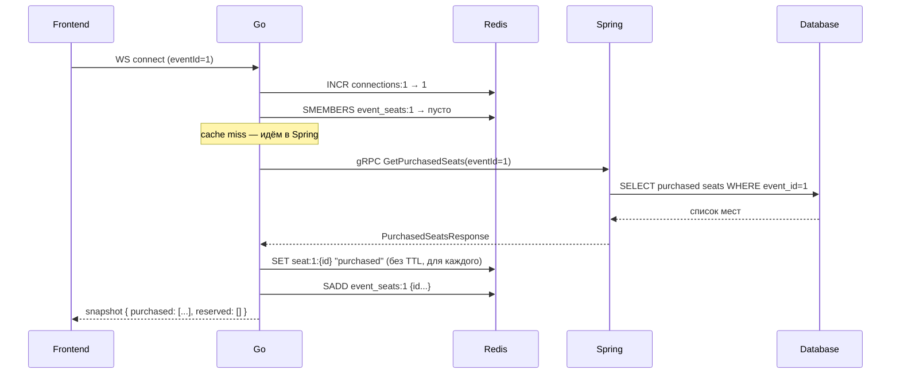
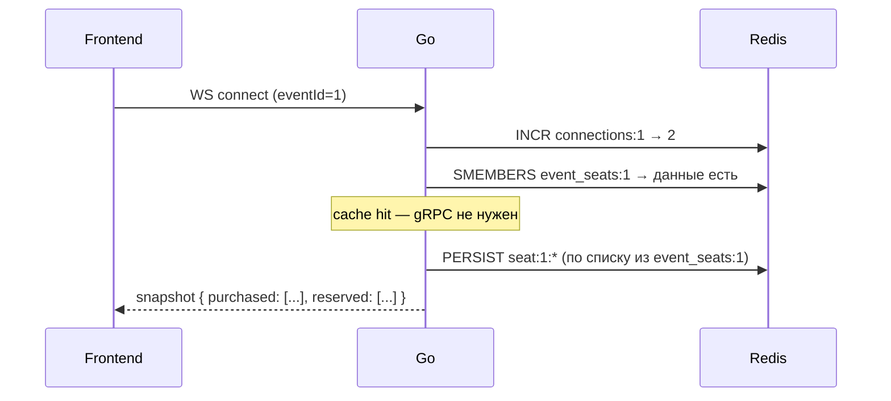
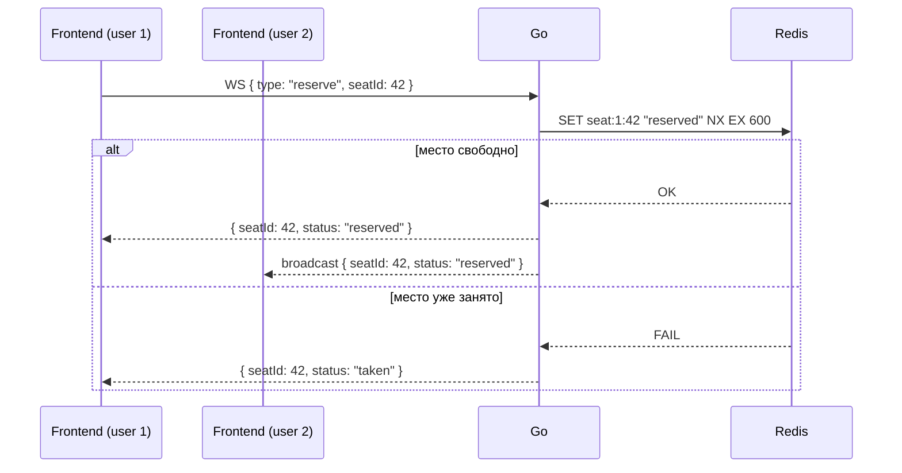
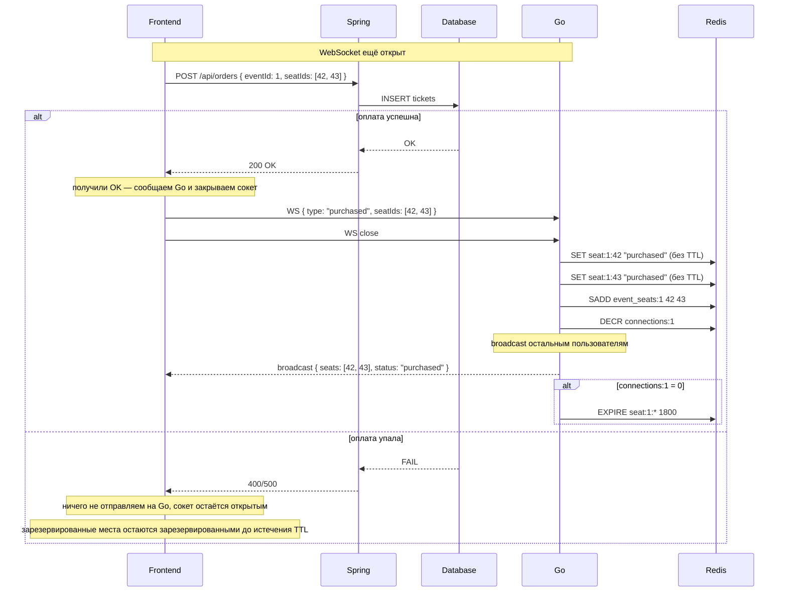
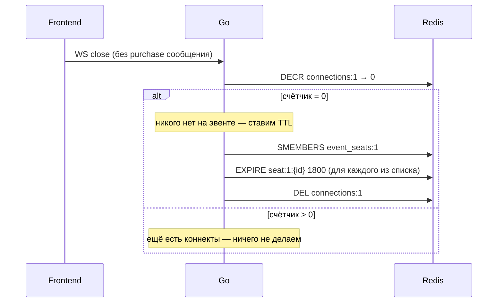
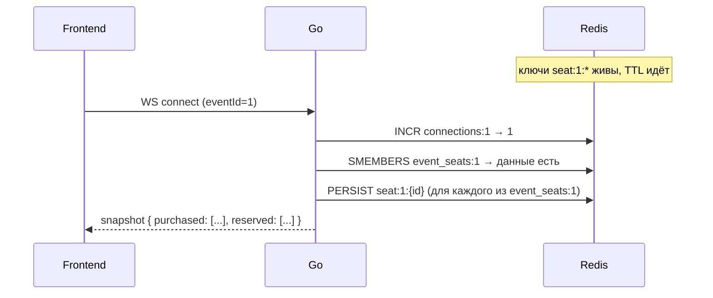
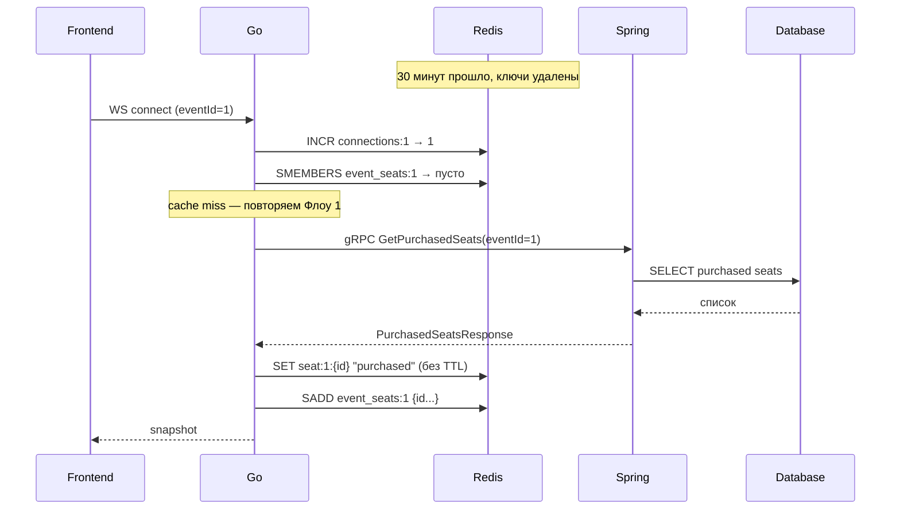
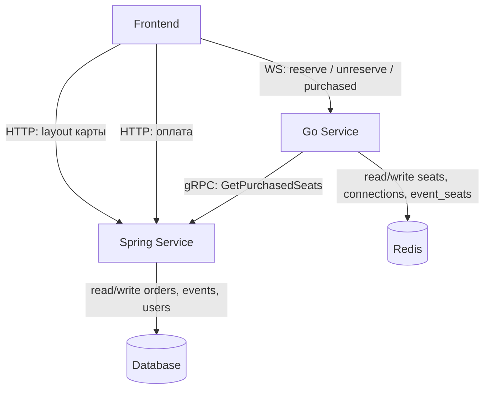

# Seatmap Architecture v3

## Принципы

| Правило | Детали |
|---------|--------|
| **gRPC только Go → Spring** | Spring вообще не знает про Go. Никакой обратной связи |
| **Redis только Go** | Spring не трогает Redis |
| **Покупка через WS** | Фронт получил OK от Spring → шлёт сообщение на Go → закрывает сокет |
| **TTL по последнему коннекту** | Пока есть сокеты на эвент — TTL снят. Закрылся последний — TTL 30 минут |

---

## Структура ключей Redis

```
seat:{eventId}:{seatId} = "purchased"   без TTL пока есть коннекты, TTL 30m после последнего
seat:{eventId}:{seatId} = "reserved"    TTL 600s всегда
event_seats:{eventId}                   SET из seatId — для быстрого PERSIST/EXPIRE
connections:{eventId}   = {count}       счётчик активных сокетов
```

---

## Флоу 1 — Первый коннект, Redis пустой (худший случай)



---

## Флоу 2 — Второй коннект, Redis горячий



---

## Флоу 3 — Резервация места



---

## Флоу 4 — Оплата (ключевой флоу)



---

## Флоу 5 — Закрытие последнего коннекта (без покупки)



---

## Флоу 6 — Переоткрытие после паузы (TTL ещё не истёк)



---

## Флоу 7 — TTL истёк, данные сгорели



---

## Полная карта коммуникаций



---

## Нюансы реализации

**Порядок сообщений в Флоу 4 критичен**
Фронт обязан сначала отправить `{ type: "purchased" }`, и только потом закрыть сокет.
Если закрыть сокет без сообщения — Go не узнает о покупке и не обновит Redis.
Используй `ws.send(...)` синхронно перед `ws.close()`.

**Что если пользователь закрыл вкладку сразу после оплаты**
Между `200 OK` от Spring и отправкой `purchased` на Go есть маленькое окно.
Если вкладка закрылась в этот момент — Go не узнает о покупке до следующего cache miss (TTL истёк или Redis перезапустился). Это приемлемо: при следующем запросе `GetPurchasedSeats` Spring вернёт актуальные данные из БД.

**PERSIST pipeline**
Redis не поддерживает `PERSIST seat:1:*` одной командой.
Используй `SMEMBERS event_seats:1` → pipeline из `PERSIST` на каждый ключ.

**Атомарность DECR + EXPIRE**
Между `DECR → 0` и `EXPIRE` может зайти новый коннект и получить `INCR → 1`.
Тогда `EXPIRE` поставит TTL на активные данные.
Решается Lua-скриптом:
```lua
local count = redis.call('DECR', KEYS[1])
if count == 0 then
  for _, key in ipairs(redis.call('SMEMBERS', KEYS[2])) do
    redis.call('EXPIRE', key, ARGV[1])
  end
  redis.call('DEL', KEYS[1])
end
return count
```
EOF
echo "done"